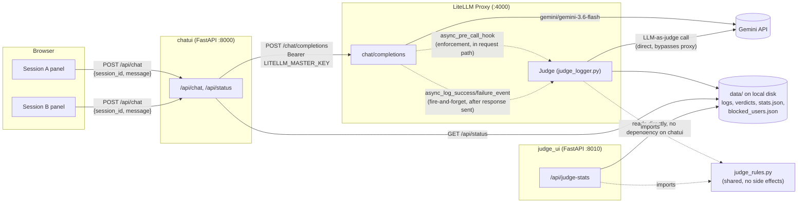
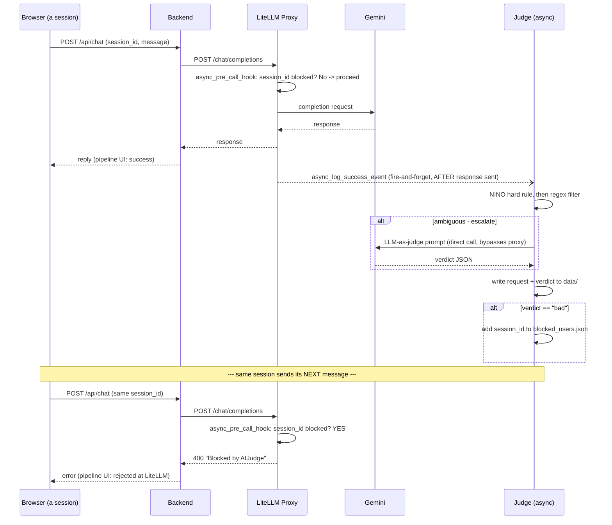

# AIJudge Architecture

This document explains how AIJudge is put together and, more importantly,
*why* — the decisions that shape it were mostly driven by one hard
requirement: **the Judge must never add latency to a chat call.** Almost
every non-obvious design choice below traces back to that constraint.

## 1. System overview

Five processes/services, four of which you run locally:

- **Browser** — a static page with two independent chat panels (Session A /
  Session B), no build step.
- **Chat UI backend** (`chatui/backend/app.py`, FastAPI, `:8000`) — serves
  `chatui/frontend/` and is the only thing that talks to LiteLLM. Holds the
  only secret the browser never sees (`LITELLM_MASTER_KEY`).
- **LiteLLM proxy** (`litellm_proxy/`, `:4000`) — OpenAI-compatible proxy in
  front of Gemini. Runs the Judge as a registered callback inside the same
  process.
- **Judge Dashboard** (`judge_ui/app.py`, FastAPI, `:8010`) — a standalone
  admin/compliance view of what the Judge is doing. Deliberately
  independent of the chat UI backend (see §5) — reads `data/` directly and
  works with or without the chat UI running at all.
- **Gemini API** — the actual model provider, called both for user-facing
  chat (via the proxy) and by the Judge itself (directly, see §4).

The dotted lines into the Judge are deliberate: one is a hook that runs
*before* the call completes (cheap), the other fires *after* it already has
(the heavy lifting). That split is the core of the whole design — see §3.
Note `judge_ui` has no arrow to or from `chatui` at all — that's
intentional, not an omission (see §5).

## 2. Components

| Component | File(s) | Responsibility |
|---|---|---|
| Frontend (chat UI) | `chatui/frontend/index.html`, `app.js`, `style.css` | Two `ChatPanel` instances, each owning its own client-generated session id; polls `/api/status` for shared judge activity; animates a request pipeline per panel. |
| Chat UI backend | `chatui/backend/app.py` | Stateless proxy between browser and LiteLLM; adds the `Authorization` header the browser never sees; exposes a lightweight `/api/status` for its own sidebar. |
| LiteLLM proxy | `litellm_proxy/config.yaml` | Declares the `gemini-flash` model and registers the Judge callback. |
| Judge | `litellm_proxy/judge_logger.py` | A `CustomLogger` callback with both an enforcement hook and a logging/judging hook (see §3); writes `data/stats.json`. |
| Shared rules | `judge_rules.py` (repo root) | Side-effect-free regex/description source for both the Judge and the dashboard — the single source of truth for what's actually enforced. |
| Judge Dashboard | `judge_ui/app.py`, `judge_ui/frontend/` | Standalone read-only view: rules, verdict breakdown, token usage, unique sessions, requests/sec, blocklist. Independent process and port; no dependency on `chatui/`. |
| Data store | `data/` (gitignored) | The only shared state across all three Python processes — flat JSON files and a log file, no database. |

## 3. The core design decision: two timelines, not one

The Judge has two responsibilities, and they deliberately run at different
points in the request lifecycle:

- **Enforcement** — `async_pre_call_hook`. Runs synchronously, *before*
  every call reaches Gemini. Kept to a single in-memory set lookup against
  the blocklist. It can only reject a call based on a verdict from a
  *previous* exchange — never the one currently in flight.
- **Judging** — `async_log_success_event` / `async_log_failure_event`.
  Fired via `asyncio.create_task` *after* the response has already gone
  back to the caller. All the expensive work — regex checks, and
  occasionally a whole extra LLM call — happens here, off the critical
  path.

The consequence, which is easy to expect wrong: **a message that is itself
judged "bad" still gets a completely normal reply.** Only that session's
*next* message gets rejected, once the background judging has finished and
updated the blocklist. There is no way to interrupt or block a response
that's already being generated without reintroducing the latency this
design exists to avoid.

## 4. Judge internals: three layers, cheapest first

`_handle_event` runs three checks in order, each escalating only if the
previous one didn't reach a verdict:

1. **`_nino_check`** — deterministic regex only, never touches an LLM. Two
   independent triggers, both "bad": an actual NI-number-shaped string
   anywhere in the exchange (a PII handling breach on its own, regardless
   of intent), or a request to verify/validate one even without a real
   number present. This is a compliance rule, not a judgment call, so it's
   never left to the LLM's variance.
2. **`_rule_check`** — a small pattern list (`SUSPICIOUS_PATTERNS`) for
   things like "ignore previous instructions" or "reveal your system
   prompt". A match doesn't mean "bad" — it means "escalate to the LLM
   judge". No match means "safe" *without* spending an LLM call.
3. **`_llm_judge`** — only reached for ambiguous cases. Calls Gemini
   **directly** (`litellm.acompletion`, not through the local proxy), tagged
   with `metadata={"aijudge_internal": True}`, which `_handle_event` checks
   first thing and returns early on — this is what stops the Judge from
   recursively logging and judging its own judgment calls.

The rubric explicitly judges **user intent, not assistant compliance**: a
prompt-injection attempt that the model successfully refuses is still
scored "bad", not "suspicious". This was a real bug found during testing —
the first version of the rubric let Gemini downgrade a clear injection
attempt to "suspicious" because the assistant happened to refuse it, so
nothing ever got blocked despite an obvious attack. Judging outcome instead
of intent means a persistent attacker who keeps getting refused never
crosses the blocking threshold.

If the LLM judge itself returns empty content (most likely its own safety
filter balking at the content it's reviewing), that's treated as **"bad"**
by default — fail closed rather than silently letting it through.

## 5. Key architecture decisions

| Decision | Why | Tradeoff / consequence |
|---|---|---|
| Judging is async, after the response is sent | Hard requirement: zero added latency to any chat call | Can never block the exchange that triggered a "bad" verdict — only the next one from that session |
| Enforcement hook is a single in-memory set lookup | Keep the one synchronous judge-adjacent code path trivial | It's a blunt yes/no; all the nuance lives in the async path |
| Judge calls Gemini directly, bypassing the local proxy | Avoid the Judge recursively logging/judging its own LLM-as-judge calls | Judge calls don't benefit from the proxy's own logging/retry config; guarded further by an explicit `aijudge_internal` flag |
| Layered detection: regex first, LLM only for ambiguous cases | Cost and latency control — most traffic is obviously fine or obviously bad | Content matching no pattern is marked "safe" without ever reaching the LLM judge — a novel, unpatterned attack could slip through |
| NINO (PII) rule is fully deterministic, no LLM involved | Compliance rules shouldn't be subject to LLM variance | Intentionally over-flags — a non-NINO string that happens to match the shape still gets blocked |
| Rubric scores intent, not compliance | A refused attack attempt is still an attack attempt | None — this closed a real gap found in testing |
| Session identity is a client-generated id, not a cookie | Cookies are one-per-domain; can't run two independent sessions in one browser tab | Backend has zero server-side session state; a session is only as trustworthy as whatever the client sends |
| No Postgres / virtual-key DB for LiteLLM's built-in admin UI | Kept the whole system to flat local JSON files, no extra infra | LiteLLM's own `/ui` admin dashboard doesn't work (it requires a DB); not needed since our own UI + blocklist file cover the same need here |
| `AIJUDGE_DATA_DIR` is anchored to the repo root via `Path(__file__).resolve()` + the right number of `.parent`s in each of the three Python entry points | They run from different working directories and different folder depths (`litellm_proxy/`, `chatui/backend/`, `judge_ui/`); a naively relative path resolved to *different* folders with no error | Each file must recompute the right `.parent` chain for its own depth — don't copy one file's chain into another without checking it |
| Judge Dashboard is a fully separate service (own process, port, and codebase), not a route on the chat UI's backend | Explicit ask: it should work as a standalone admin/compliance tool, usable without the chat test UI running at all | Two FastAPI apps instead of one; `judge_rules.py` exists specifically so they don't duplicate (and drift on) what the rules actually are |

## 6. Data & storage

Everything the Judge sees and decides lives under `AIJUDGE_DATA_DIR`
(default `./data`, anchored to the repo root, gitignored):

- `data/logs/<uuid>.json` — every request/response pair
- `data/verdicts/<uuid>.json` — the Judge's verdict for that pair (read by
  the backend's `/api/status` for the "Recent Verdicts" panel)
- `data/blocked_users.json` — flat JSON array of blocked session ids (read
  by the Judge's own enforcement hook, `/api/status`, and `/api/judge-stats`)
- `data/judge_activity.log` — human-readable trace of every exchange, every
  prompt sent to the LLM judge, its raw response, and the final verdict
  (also mirrored to the LiteLLM proxy's console)
- `data/stats.json` — running totals only the Judge writes and only the
  Judge Dashboard reads: request count, verdict breakdown, token usage
  (chat traffic and judge-overhead tracked separately), unique sessions
  seen, and a rolling window of request timestamps the dashboard turns
  into requests/sec

There is no database and no locking — writes are whole-file rewrites of
small JSON structures. Fine at this scale; wouldn't survive many concurrent
writers. `stats.json` updates specifically rely on there being no `await`
between reading and writing it within a single update (see
`_update_stats` in `judge_logger.py`) — asyncio only switches tasks at an
`await`, so that's safe today but would need a real lock if that method
ever grew one.

## 7. Known limitations

- The regex filter in `_rule_check` is a small, illustrative pattern list —
  novel attacks that match nothing in it are marked "safe" without an LLM
  review.
- Blocking is per client-chosen session id, not per-IP or per-account —
  there's no auth layer. This is a local testing setup, not a hardened
  multi-tenant deployment.
- The NINO check is shape-based and will false-positive on non-NINO strings
  that happen to fit the pattern — an accepted tradeoff for PII handling.
- LLM-as-judge verdicts are still probabilistic where they're used (the
  ambiguous middle tier) — the hard rules (NINO) and the intent-based
  rubric narrow, but don't eliminate, that variance.
